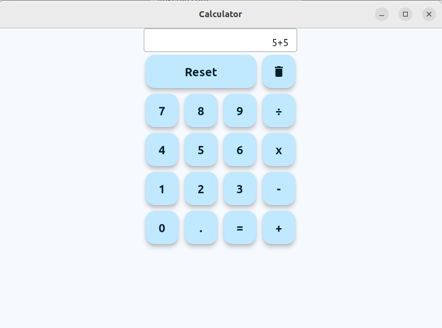

# Flutter Classic Calculator

A classic calculator application built using Flutter, designed to replicate the functionality of a real-world calculator.

## Features

- Addition, subtraction, multiplication, and division operations.
- Support for decimal numbers.
- Basic arithmetic operations.

## Screenshots



## Getting Started

To run this application on your local machine, follow these steps:

### Prerequisites

- Flutter SDK installed

### Installation

1. Clone the repository:

   ```bash
   git clone https://github.com/Havenganesh/flutter_Calc.git
